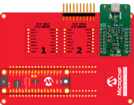

<!-- Please do not change this html logo with link -->

# AN3641 - Low-Power, Cost-Efficient PIR Motion Detection Using the tinyAVR® 2 Family

This application note describes how to use the 12-bit differential ADC with PGA in the tinyAVR® 2 Family of microcontrollers and how to collect measurements using a Passive InfraRed (PIR) sensor while keeping the current consumption at a minimum.

The example in this application note may easily be changed to use any PIR sensor, and has been created in a way that makes it easy to modify the sampling acquisition parameters, the filtering parameters, and detection threshold parameters. 

The application may be used to implement PIR sensor solutions were low power consumption is important.

## Related Documentation

* [AN3641 - Low-Power, Cost-Efficient PIR Motion Detection Using the tinyAVR® 2 Family](https://microchip.com/DS00003641)
* [ATtiny1627 Device Page](https://www.microchip.com/wwwproducts/en/ATTINY1627)

## Software Used
* [Atmel Studio](https://www.microchip.com/mplab/avr-support/atmel-studio-7) 7.0.1931 or later
* Atmel Studio ATtiny_DFP version 1.4.316 or later
* [Data Visualizer](https://www.microchip.com/mplab/avr-support/data-visualizer), standalone or Extension in Atmel Studio

## Hardware Used
* [Microchip ATtiny1627 Curiosity Nano Evaluation Kit](https://www.microchip.com/developmenttools/ProductDetails/DM080104)
* [Curiosity Nano Base for Click boards](https://www.microchip.com/DevelopmentTools/ProductDetails/AC164162)
* [MIKROE-3339 Click board](www.mikroe.com/pir-click)
* Micro-USB cable (Type-A/Micro-B)

## Setup

* Connect the modified Click board to slot 3 of the Curiosity Nano Base for Click boards™
* Connect the ATtiny1627 Curiosity Nano to the Curiosity Nano Base for Click boards™

## Operation

* Connect the ATtiny1627 Curiosity Nano to a computer using a USB cable
* Download the zip file or clone the example to get the source code
* Open the .atsln file with Atmel Studio
* Press Start Without Debugging (CTRL+ALT+F5) to run the example
* Wave a hand or walk in front of the sensor and observe the red LED flashing

## Conclusion

This example has shown how to collect measurements using a Passive InfraRed (PIR) sensor while keeping the current consumption at a minimum with an AVR® microcontroller.